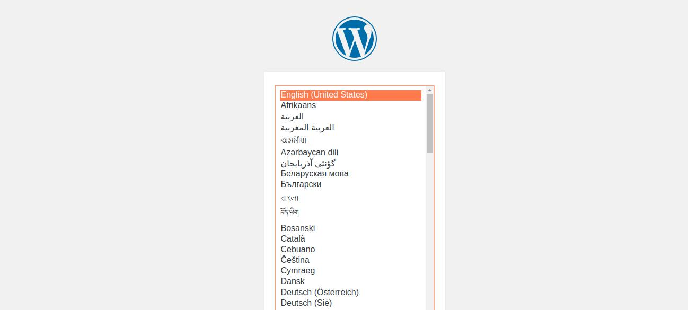

# wordpress-maria
Launch wordpress setup along with mariadb

This is docker-compose project to launch wordpress server, which uses mariadb in backend.

This can be done is simple steps as below,

1) Clone this project to your local repository

```
git clone https://github.com/vpatiltech/wordpress-maria.git
```

2) Move inside the local project directory

```
cd wordpress-maria
```


3) Run docker-compose up command to start the service
```
docker-compose up -d
```


4) Validate the status of services using below command

```
docker-compose ps
```


5) To install and setup Wordpress, access wordpress through your browser on port 8081 by running http://localhost:8081



6) To stop the service run below command
```
docker-compose down
```

